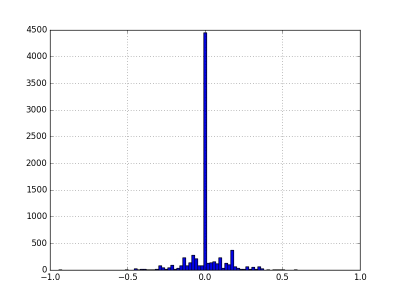
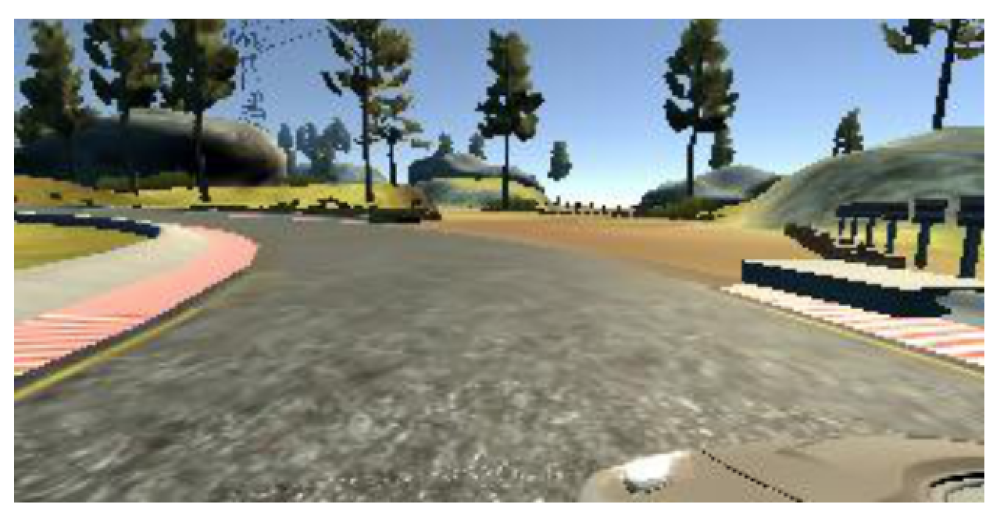
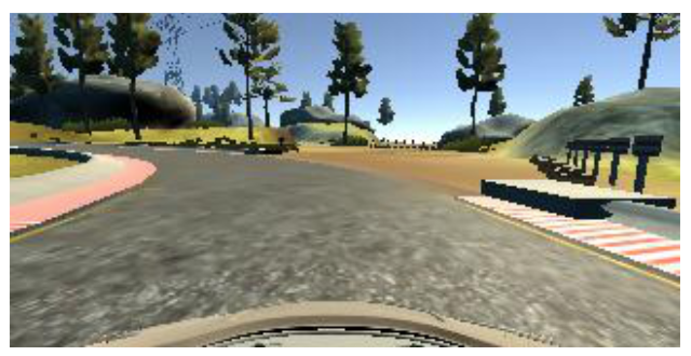
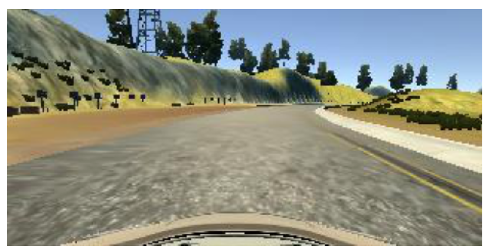
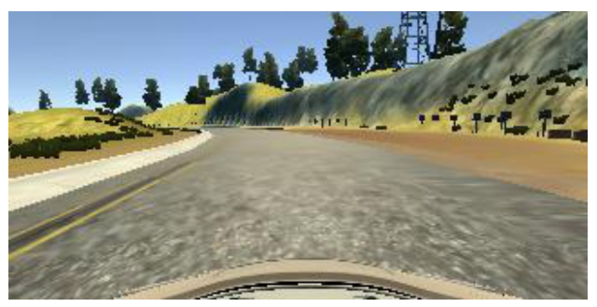
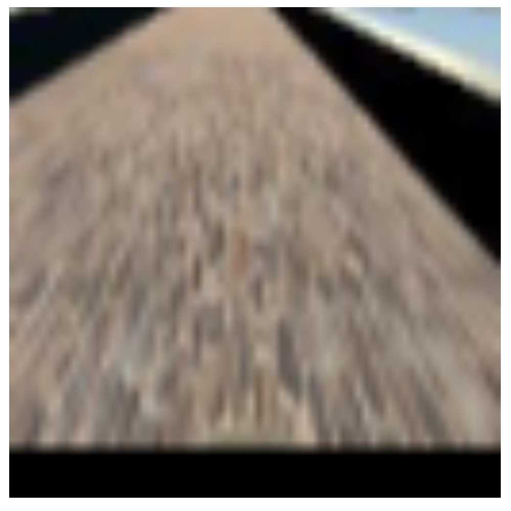
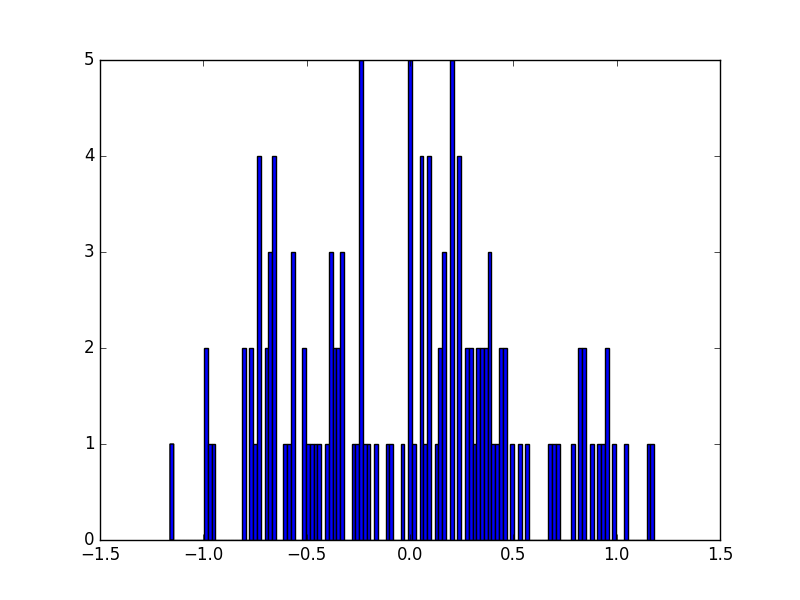

# 1. Introduction
The purpose of this project is to build and learn a deep neural network that can mimic the behavior of humans driving a car. A simple simulator is used for this purpose. When we drive a car, the simulator stores images and steering angles for training. You can learn the neural network with the stored training data and check the results of training in the simulator's autonomous mode.

# 2. Overview of the simulator
## download link
* [Linux](https://d17h27t6h515a5.cloudfront.net/topher/2016/November/5831f0f7_simulator-linux/simulator-linux.zip)
* [macOS](https://d17h27t6h515a5.cloudfront.net/topher/2016/November/5831f290_simulator-macos/simulator-macos.zip)
* [Windows 32-bit](https://d17h27t6h515a5.cloudfront.net/topher/2016/November/5831f4b6_simulator-windows-32/simulator-windows-32.zip)
* [Windows 64-bit](https://d17h27t6h515a5.cloudfront.net/topher/2016/November/5831f3a4_simulator-windows-64/simulator-windows-64.zip)

## Running the Simulator
When you first run the simulator, you’ll see a configuration screen asking what size and graphical quality you would like.

### Training mode
  * You’ll enter the simulator and be able to drive the car with your arrow keys.

### Autonomous mode
  * Set up your development environment with the environment.yml
  * Run the server : `python drive.py model.json`
  * You should see the car move around

# 3. Data Collection
Enter training mode in the simulator, start driving the car. When you are ready, hit the record button in the top right to start recording. Continue driving for a few minutes, hit the record button again to stop recording. IMG folder contains all the frames of your driving. Each row in driving_log.csv file correlates your image with the steering angle, throttle, brake, and speed of your car.

You can use sample data for track 1 [here](https://d17h27t6h515a5.cloudfront.net/topher/2016/December/584f6edd_data/data.zip).

After learning using only the sample data for Track 1 above, successfully completing Track 2 was my challenge.

# 4. Network Architecture
My convolutional neural network architecture was inspired by NVIDIA's End to End Learning for Self-Driving Cars [paper](https://arxiv.org/pdf/1604.07316v1.pdf). Starting from this base model, I refer to various papers and made trial and error several times, finally making the following architecture.

| Layer (type)                              | Output Shape       | Param # |
|-------------------------------------------|--------------------|---------|
| lambda_1 (Lambda)                         | (None, 64, 64, 3)  | 0       |
| convolution2d_1 (Convolution2D)           | (None, 30, 30, 24) | 1824    |
| prelu_1 (PReLU)                           | (None, 30, 30, 24) | 21600   |
| batchnormalization_1 (BatchNormalization) | (None, 30, 30, 24) | 48      |
| convolution2d_2 (Convolution2D)           | (None, 13, 13, 36) | 21636   |
| prelu_2 (PReLU)                           | (None, 13, 13, 36) | 6084    |
| batchnormalization_2 (BatchNormalization) | (None, 13, 13, 36) | 72      |
| convolution2d_3 (Convolution2D)           | (None, 5, 5, 48)   | 43248   |
| prelu_3 (PReLU)                           | (None, 5, 5, 48)   | 1200    |
| batchnormalization_3 (BatchNormalization) | (None, 5, 5, 48)   | 96      |
| convolution2d_4 (Convolution2D)           | (None, 5, 5, 64)   | 27712   |
| prelu_4 (PReLU)                           | (None, 5, 5, 64)   | 1600    |
| batchnormalization_4 (BatchNormalization) | (None, 5, 5, 64)   | 128     |
| maxpooling2d_1 (MaxPooling2D)             | (None, 4, 4, 64)   | 0       |
| convolution2d_5 (Convolution2D)           | (None, 4, 4, 64)   | 36928   |
| prelu_5 (PReLU)                           | (None, 4, 4, 64)   | 1024    |
| batchnormalization_5 (BatchNormalization) | (None, 4, 4, 64)   | 128     |
| maxpooling2d_2 (MaxPooling2D)             | (None, 3, 3, 64)   | 0       |
| flatten_1 (Flatten)                       | (None, 576)        | 0       |
| dense_1 (Dense)                           | (None, 1164)       | 671628  |
| prelu_6 (PReLU)                           | (None, 1164)       | 1164    |
| batchnormalization_6 (BatchNormalization) | (None, 1164)       | 2328    |
| dropout_1 (Dropout)                       | (None, 1164)       | 0       |
| dense_2 (Dense)                           | (None, 100)        | 116500  |
| prelu_7 (PReLU)                           | (None, 100)        | 100     |
| batchnormalization_7 (BatchNormalization) | (None, 100)        | 200     |
| dropout_2 (Dropout)                       | (None, 100)        | 0       |
| dense_3 (Dense)                           | (None, 50)         | 5050    |
| prelu_8 (PReLU)                           | (None, 50)         | 50      |
| batchnormalization_8 (BatchNormalization) | (None, 50)         | 100     |
| dense_4 (Dense)                           | (None, 10)         | 510     |
| prelu_9 (PReLU)                           | (None, 10)         | 10      |
| batchnormalization_9 (BatchNormalization) | (None, 10)         | 20      |
| dense_5 (Dense)                           | (None, 1)          | 11      |

## Things to note are
  * I've added a lambda layer on the top similar to the [comma.ai model](https://github.com/commaai/research/blob/master/train_steering_model.py) to normalize the data
    ```python
    Lambda(lambda x: x / 127.5 - 1.0, input_shape=(64, 64, 3))
    ```

  * I added a pooling layer to the last two convolution layers. Its function is to progressively reduce the spatial size of the representation to reduce the amount of parameters and computation. Therefore, it is possible to control overfitting. At first I added it to all convolution layers, but the size of the weights file was so large that I only added it to the last two layers.

  * The steering angle to be predicted is a value between -1 and 1 which is symmetric to zero, and a value close to 0 will often appear. Considering this feature, tahn was considered suitable as the activation function of the last output layer.

  * Reference : [Delving Deep into Rectifiers](https://arxiv.org/abs/1502.01852)
    * All ReLUs replaced by PReLUs
    * Use 'he_normal' initializer
  
  * Reference : [Batch Normalization](https://arxiv.org/abs/1502.03167)
    * Batch normalization was added before all PReLUs.

  * Batch Normalization has its own regularization effect. So, I added Dropout(80%) in the first two fully connected layers.

The main difference between our model and the NVIDIA mode is than we did use MaxPooling layers just after each Convolutional Layer in order to cut down training time. For more details about our network architecture please refer following figure.

# 5. Training
## Data Description
The dataset consists of 8036 rows. Since each row contains images corresponding to three cameras on the left, right, and center, a total of 24,108 images exist.

But, training data is very unbalanced. The 1st track contains a lot of shallow turns and straight road segments. So, the majority of the dataset's steering angles are zeros. Huge number of zeros is definitely going to bias our model towards predicting zeros.



## Data preprocessing
I removed the useless part of the image(past the horizon, hood of the car) and kept track. And I resized the resulting image to a 64x64 in order to reduce training time. Resized images are fed into the neural network.


## Data Augmentation
Augmentation refers to the process of generating new training data from a smaller data set. This helps us extract as much information from data as possible.

Since I wanted to proceed with only the given data set if possible, I used some data augmentation techniques to generate new learning data.

### Randomly choosing camera
During the training, the simulator captures data from left, center, and right cameras. Using images taken from left and right cameras to simulate and recover when the car drifts off the center of the road. My approach was to add/substract a static offset from the angle when choosing the left/right camera.

Left | Center | Right
-----|--------|------
 |  | 

### Random shear
I applied random shear operation. The image is sheared horizontally to simulate a bending road. The pixels at the bottom of the image were held fixed while the top row was moved randomly to the left or right. The steering angle was changed proportionally to the shearing angle. However, I choose images with 0.9 probability for the random shearing process. I kept 10% of original images in order to help the car to navigate in the training track.

Before | After
-------|-------
 | 

### Random flip
Each image was randomly horizontally flipped and negate the steering angle with equal probability. I think, this will have the effect of evenly turning left and right.

Before | After
-------|-------
 | 

### Random gamma correction
Chaging brightness to simulate differnt lighting conditions. Random gamma correction is used as an alternative method changing the brightness of training images.

Before | After
-------|-------
 | 

### Random shift vertically
The roads on the second track have hills and downhill, and the car often jumps while driving. To simulate such a road situation, I shifted the image vertically randomly. This work was applied after image preprocessing.

Before | After
-------|-------
 | 

## Data Generators
In this training, I used a generator, which randomly samples the set of images from csv file. As mentioned earlier, because there is a lot of data with a steering angle of 0, I removed this bias by randomly extracting the data. These extracted images are transformed using the augmentation techniques discussed above and then fed to the model.



I also used a generator for validation. This generator receives data for validation and returns the corresponding center camera image and steering angle. The validation data was created by leaving only 10% of the row with zero steering angle in the training data.

## Training parameters
* Adam optimizer with a learning rate of 0.01
  * One of the advantages of Batch Normalization is that it can achieve high learning rate.
* 128 batch size
* 5 training epochs
  * Because I used my desktop for training, I tried to use as many ways as possible to reduce my training time.

# 6. Driving
Run drive.py using the saved model.
```python
python drive.py model.json
```
* It receives the image of the central camera from the simulator, preprocesses it, and predicts the steering angle.
* Returns the predicted angle and throttle again.
* The throttle adjusted to 0.5 to climb the hill of track 2.

# 7. Conclusions
It was a fun but difficult project. The concept of data augmentation was not difficult because of previous project experience, and the use of generators was quickly becoming familiar. The nvidia model worked better than I expected, but it was pretty hard to get there a bit further. I have repeated various experiments and have reviewed several papers, but it was not as easy as I thought to improve the results. Aboeve all, I was embarrassed that the smaller val_loss did not seem to guarantee a smoother ride.